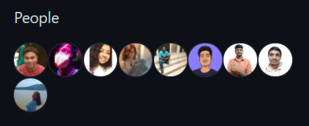
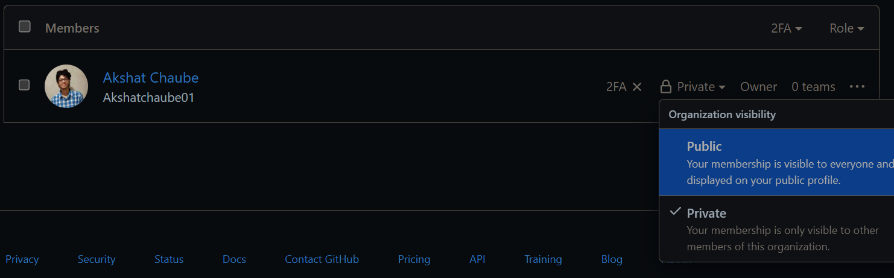

# **AlgoManiacZ**

Welcome to AlgoManiacZ where anyone interested in DSA and competitive coding can connect and interact with fellow peers from all over the globe and not only learn but also collaborate on various projects!

  

 

# Community Support

> Raise an issue to join the **Design and Code** GitHub Community.

     
      
### Steps to join The Design and Code Github Organization:

> 1. Go to the issues tab [here](https://github.com/AlgoManiacZ/support/issues).
>   
> 2. In the Issues Tab and create a new issue.
> 
> 3. Select the "Invitation to AlgoManiacZ - Github Organization" and fill in your details.
> 
> 4. That's it you'll recieve an e-mail invitation to join our org. Make sure you accept it, than only you will become a member of our Github Organization.

### How do I set the Organization to Public?

> 1. Navigate to our community page: https://github.com/AlgoManiacZ/
>   
> 2. Click on the people header or click [here](https://github.com/orgs/AlgoManiacZ/people) :  
>   
>   
>   
> 3. Enter your github username in the searchbar:  
>   
>   
>   
> 4. Check if it is `Private` (the default) and set it to `Public`:  
>   
>   
  

## Socials

>Join our discord community [here](https://discord.gg/3G3Tqbbf2g)   
>Subscribe our YouTube channel [here](https://www.youtube.com/channel/UC9mw9jnVB7vJboha-SuOysQ)

<a href="https://discord.gg/3G3Tqbbf2g">👋 join our discord community <strong>AlgoManiacZ</strong> </a>
